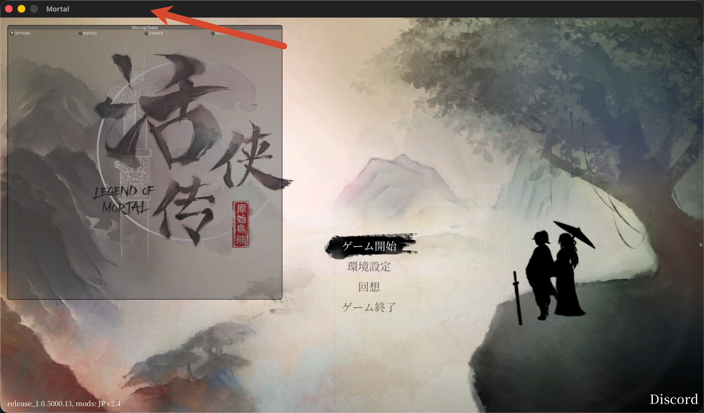

[ホーム](../README.md) · [繁體中文](guide.zht.md) · [简体中文](guide.zhs.md) · [한국어](guide.ko.md)

本書は、2026年8月に実機で動作確認を行った検証済みの構成手順です。Sikarugir、Wine、およびWindows版Steam環境を利用し、購入済みの正規版『活俠傳』（Legend of Mortal）をApple Silicon Mac上でプレイするためのセットアップ手順を解説します。

## 検証済み環境

| 項目 | 検証構成 / バージョン |
| --- | --- |
| ゲーム | Steam AppID `1859910`、Build ID `20337760`、`release_1.0.5000.13` |
| Unity | `2020.3.49f1` |
| 実行ファイル | `Mortal.exe`、PE32 / x86 |
| ラッパー | Sikarugir Template `1.0.11` |
| Wine | Sikarugir Wine `10.0` |
| グラフィックバックエンド | 32ビット DXMT、D3D11 → Metal |
| Modフレームワーク | BepInEx `6.0.0-be.785` x86 Mono |

Wine、Steam、macOS、およびゲーム本体のアップデートにより、互換性や動作状況が変化する可能性があります。設定を変更する際は、バージョン番号を記録し、ログを保存した上で、タイムスタンプ付きのバックアップを作成してください。

## 1. Windows版Steam用の独立ラッパーを作成する

事前に以下の環境とファイルを用意します。

- Apple Silicon Mac（macOS 14以降）
- Rosetta 2
- [Sikarugir公式プロジェクト](https://github.com/Sikarugir-App/Sikarugir)
- Steamアカウントで購入済みの[『活俠傳』](https://store.steampowered.com/app/1859910/Legend_of_Mortal/)
- 十分な空きディスク容量（ラッパー、Steam、ゲーム本体、各段階のバックアップ用）

Sikarugir Creatorで独立したラッパー（例：`SteamWin.app`）を作成し、専用のWine prefix内で以下の手順を順に実行します。

1. Wine prefixを初期化し、`Program Files`と`Program Files (x86)`の両ディレクトリが生成されていることを確認する。
2. Winetricksで`cjkfonts`をインストールする。
3. レジストリ設定`hidewineexports=enable`を適用する。
4. Windows版Steamをインストールする。
5. 起動ターゲットを`C:\Program Files (x86)\Steam\steam.exe`に設定する。
6. Steamにログインし、AppID `1859910`（『活俠傳』）をインストールする。

macOSネイティブ版SteamとWindows版Steamは同一システム上で共存可能です。ログインやネットワーク接続でエラーが発生した場合は、アカウントのセッション競合を防ぐため、もう一方のSteamクライアントを完全に終了してください。

### 事前にゲームのアーキテクチャを確認する

Steamストアページのシステム要件表記だけでは、実際のバイナリアーキテクチャを正確に判断できません。ターミナルで以下のコマンドを実行して確認します。

```bash
file "/path/to/LegendOfMortal/Mortal.exe"
```

検証対象ビルドでの出力結果：

```text
PE32 executable (GUI) Intel 80386, for MS Windows
```

Windows版Steamクライアント自体は32ビットのブートストラップを持つことが多いですが、グラフィックバックエンドの選定にあたっては、ゲーム本体（`Mortal.exe`）のPE32（32ビット）アーキテクチャを基準に判断する必要があります。

## 2. D3D11グラフィック初期化エラーを修復する

主な症状：Steam上で一瞬「プレイ中」と表示された直後にゲームが強制終了し、エラーダイアログまたは`Player.log`に以下のエラーが出力される。

```text
Failed to initialize graphics.
InitializeEngineGraphics failed
d3d11: failed to create device and context (80004005)
```

各グラフィックバックエンドの検証結果は以下のとおりです。

- Unity OpenGL：ゲームビルド側に対象のGraphics Deviceサポートが含まれていない。
- WineD3D + MoltenVK：Apple GPUは認識されるものの、Direct3D Feature Levelのネゴシエーションに失敗する。
- D3DMetal：64ビットのD3D11/D3D12専用のため、32ビットバイナリには適用できない。
- DXMT：32ビット対応のD3D10/11モジュールを提供しており、今回のPE32（32ビット）バイナリに適合する。

### DXMTが実際に適用されているか確認する

ラッパーのUI上でDXMTを有効にしても、設定ファイルに書き込まれただけで実行時に正しくロードされていない場合があります。以下の項目を確認してください。

- `WINEDEBUG=+loaddll`の出力ログで、対象の`d3d11.dll`、`dxgi.dll`、`winemetal.dll`が実際にロードされているか。
- 適用されているEngine側DLLのSHA-256ハッシュ値が、対象DXMTバージョンのものと一致しているか。
- `Player.log`に`Direct3D 11 level 11.1`および`Apple <GPU>`が記録されているか。

検証環境では、UI上でDXMTを有効化した初回起動時にも、実際にはEngineディレクトリ内のWineD3Dが読み込まれていました。そのため、安全にロールバック可能な方法でEngineレイヤーの手動置換を行いました。元の32ビットWineD3Dモジュールをバックアップした上で、対応バージョンのDXMTモジュール（`d3d10core.dll`、`d3d11.dll`、`dxgi.dll`、`winemetal.dll`）を実際に参照される`i386-windows`ディレクトリへ配置し、対応する`winemetal.so`をUnixモジュールディレクトリへ配置しました。

使用するEngineによってディレクトリ構成が異なる場合があります。DLLロードログから実際の検索パスを特定した上でファイルを配置し、置換前後のSHA-256ハッシュ値を必ず記録してください。

DLLロード成功時のログ例：

```text
Loaded C:\windows\system32\winemetal.dll
Loaded C:\windows\system32\DXGI.DLL
Loaded C:\windows\system32\d3d11.dll
```

Unityグラフィック初期化成功時のログ例：

```text
Direct3D:
    Version:  Direct3D 11.0 [level 11.1]
    Renderer: Apple <GPU>
Begin MonoManager ReloadAssembly
```

通常時のゲーム起動には、Steam AppIDを指定する起動オプション（コマンドライン引数）の利用を推奨します。

```text
steam.exe -applaunch 1859910
```

## 3. Retinaディスプレイと解像度の設定

WineのRetinaモードに対応するレジストリ設定：

```text
HKCU\Software\Wine\Mac Driver\RetinaMode = "Y"
```

RetinaレンダリングとUnityのUIスケーリングは独立した仕組みです。『活俠傳』のUnity UIロジックはWindowsのDPI設定を参照しません。高解像度設定ではグラフィックが精細になる一方でUIが小さくなり、低解像度設定ではUIが大きく表示されるものの拡大による表示のぼやけが生じます。

ランチャー側で解像度を強制固定せず、ゲーム内の解像度設定に委ねる構成を推奨します。検証環境では`1920×1200`を選択し、ショートカットの起動引数から解像度固定用の`-screen-width`および`-screen-height`を削除しました。

## 4. ショップの価格および合計金額が空白になる問題の修正

主な症状：ゲーム内の会話テキスト、一般的な数値、銅銭アイコンは正常に表示されるものの、ショップ画面のアイテム単価と合計金額のみが空白となり表示されない。

Unityのリソースを解析したところ、`MoneyValue`および`MoneyText` UIコンポーネントには内蔵フォント`SourceHanSerifTC-Bold`が割り当てられており、デフォルトテキストには`50`が含まれ、フォントアトラス（Font Atlas）にも`0`〜`9`の数字グリフが存在していました。この問題の根本原因は、Wine prefix内のフォントセットおよびシステムフォントのマッピングが不足していたことにあります。

作成直後のWine prefixに含まれるフォントファイルは以下の2点のみです。

```text
sourcehansans.ttc
unifont.ttf
```

`cjkfonts`を導入していてもフォントのカバー範囲が不足するため、Winetricksから以下をインストールして補完します。

```text
fonts → allfonts
```

作業前にWindows版Steamを完全に終了し、以下のファイル・ディレクトリをバックアップしてください。

- `drive_c/windows/Fonts`
- `system.reg`
- `user.reg`
- `userdef.reg`

インストール完了後、フォントディレクトリ内のファイル数は2個から121個（約284 MB）に増加し、Arial、Tahoma、Calibri、Meiryo、WenQuanYiなどのレジストリエントリが正常に登録されます。wineserverを一度終了してゲームを立ち上げ直すと、ショップの金額が正常に表示されるようになります。

各フォントには固有のソフトウェアライセンスが適用されます。フォントは必ずWinetricks経由で正規の配信元から取得・導入し、公開リポジトリや配布用ラッパーにはフォントバイナリを同梱しない（再配布を行わない原則を維持する）運用を徹底してください。

## 5. DoorstopとBepInEx Mod読み込みの修復

詳細なトラブルシューティングと技術的経緯については、個別ケーススタディ：[ケース：Wine 10 / x86版『活俠傳』で日本語化Modを読み込む](cases/japanese-mod.ja.md)を参照してください。

### Mod導入前の事前確認とファイルバックアップ

各ZIPアーカイブに対して以下の確認・手順を実行します。

1. アーカイブ内のパス構成を確認し、絶対パスや`..`を含むパストラバーサル（Path Traversal）のセキュリティリスクを排除する。
2. `winhttp.dll`および各プラグインDLLがx86（32ビット）アーキテクチャであることを確認する。
3. 上書き対象となる既存ファイルのリストを作成する。
4. 同名の既存ファイルをすべてタイムスタンプ付きのバックアップディレクトリに退避する。
5. 展開・配置後に各ファイルのSHA-256ハッシュ値を照合する。
6. ゲームを起動し、ログファイルの更新日時が今回の実行時刻と一致していることを確認する。

Modパッケージには過去の`LogOutput.log`が残留している場合があります。フレームワークの動作状況は、ログの更新日時、プロセスがロードしたモジュール、およびChainloaderの出力ログから総合的に判断してください。

### ステップ1：Doorstopを有効化する（DLLオーバーライド）

`winecfg → Libraries`を開き、ゲーム本体（`Mortal.exe`）に対する個別設定を追加します。

```text
winhttp = native,builtin
```

`Mortal.exe`のみに適用されるアプリケーション個別（Application-specific）のDLLオーバーライド設定を使用します。ゲーム実行時、プロセス内にローカルの`winhttp.dll`とBepInEx Preloaderがロードされていることを確認します。

### ステップ2：Unityバージョンに一致する完全なcorlibsを配置する

バイナリ比較の結果、ゲームに同梱されている`Mortal_Data/Managed/mscorlib.dll`のサイズは`3,906,048`バイト（ストリップ版）であるのに対し、Unity `2020.3.49f1`に対応する未ストリップ完全版（unstripped corlib）のサイズは`4,065,792`バイトでした。

正規の手順で取得した、Unityバージョンと厳密に一致する未ストリップ版corlibs一式を以下に配置します。

```text
BepInEx/unstripped_corlib/
```

`doorstop_config.ini`を編集します。

```ini
[General]
enabled = true
target_assembly = BepInEx\core\BepInEx.Unity.Mono.Preloader.dll

[UnityMono]
dll_search_path_override = "BepInEx\unstripped_corlib;BepInEx\core"
```

corlibsはUnityエンジンのバージョンと厳密に一致している必要があり、かつUnityのソフトウェア利用規約に従って取り扱う必要があります。公開リポジトリおよびMod配布パッケージにはcorlibsバイナリを同梱しません（再配布を行わない原則を維持します）。

### ステップ3：Wine修正パッチを含むBepInEx 6を使用する

旧バージョンのBepInEx 6は、Wine 32ビット環境下で以下の例外をスローして停止することがあります。

```text
InvalidOperationException:
Cannot set the value of PlatformHelper.Current once it has been accessed.
```

この問題は[BepInEx issue #1201](https://github.com/BepInEx/BepInEx/issues/1201)で報告され、[PR #1254](https://github.com/BepInEx/BepInEx/pull/1254)で修正されています。検証環境では、この修正パッチを取り込んだx86 Monoビルド`6.0.0-be.785`を採用しました。差し替えを行う前に`BepInEx/core`を完全にバックアップしてください。

ロード成功時のログ例：

```text
BepInEx 6.0.0-be.785
System platform: Windows 10 (Wine 10.0) 64-bit
Process bitness: 32-bit (x86)
Chainloader initialized
```

その後、各プラグインが順次ロードされます。検証環境では、DiceMasterおよび日本語化Modの計5個のプラグインがChainloaderによってすべて正常に読み込まれました。なお、DiceMaster単体で動作しない場合も阻害要因（`winhttp`オーバーライドの未設定、corlibsのストリップ、BepInExのWine初期化例外）は根本的に同一であるため、本節のDoorstop / corlibs / BepInEx Wine修復手順によって完全に修正・動作させることができます。

## 6. 既知の問題

### ウィンドウ切り替え後にタイトルバーをクリックして操作を復帰する

検証済みの Build `20337760`、Sikarugir Wine `10.0` 環境において、ゲームから他の macOS アプリへ切り替えた後に『活俠傳』へ復帰すると、画面は表示されたままでもキーボード・マウス・コントローラーの入力が即座に応答しない場合があります。

復帰手順：

1. 『活俠傳』の `Mortal` ウィンドウへ切り替えて戻る。
2. ウィンドウ上部にある macOS のタイトルバー（下図の赤矢印が示す暗色領域）を1回クリックする。
3. ゲーム画面へ戻り、操作を再開する。



Steam の全体 Overlay および『活俠傳』の個別 Overlay を無効化することで、発生頻度を低減できます。タイトルバーのクリックは現時点で検証済みの即時復帰手順です。根本原因は調査中ですが、Wine・Unity・macOS 間におけるウィンドウフォーカスの受け渡しに起因する挙動と見られます。

| ゲームバージョン | 発生条件 | 結果 | 証拠 | 確信度 |
| --- | --- | --- | --- | --- |
| Build `20337760` / `release_1.0.5000.13` | 別のmacOSアプリからWineのゲームウィンドウへ戻る | `Mortal`のタイトルバーをクリックすると操作が復帰 | 実機での再現とスクリーンショット | 高 |

## 7. 日常の運用・メンテナンス

- Steam全体のプロパティおよび『活俠傳』個別プロパティで「ゲーム中のSteamオーバーレイ」を無効化することを推奨します。別アプリへのウィンドウ切り替え後にキー入力が受け付けなくなる現象を抑制できます。
- プレイ中は`caffeinate`コマンド等を利用してMacのスリープを防止することを推奨します。MacBookのディスプレイ開閉によるスリープ、画面ロック、外部ディスプレイの抜き差し（ホットプラグ）が発生した場合は、ゲーム、Windows版Steam、およびwineserverセッションを完全に再起動することをお勧めします。
- Windows版Steamを長時間バックグラウンドで待機させていると、`-applaunch`コマンドによる起動に応答しなくなる場合があります。Steamの`gameprocess_log.txt`に新規ログが出力されない場合は、該当prefixのSteamおよびWineセッションを再起動してください。
- ゲームおよびSteamを終了する際は、Windows版Steamメニューの`Steam → Exit`から終了してください（macOSのDock上のWineアイコンは単なるウィンドウプロキシです）。

## 8. リポジトリ同梱の読み取り専用診断スクリプトを使用する

```bash
skills/run-legend-of-mortal-on-mac/scripts/inspect-lom-wrapper.sh \
  "/path/to/SteamWin.app"
```

このスクリプトは、ラッパーの設定、バイナリアーキテクチャ、Steamマニフェスト（manifest）、レジストリ設定、フォント数、DXMTモジュールのハッシュ値、BepInExログ、および実行中プロセスを読み取り専用で診断します。WineやSteam、ゲームプロセスの起動・終了は行わず、ファイルを改変することもありません。

## 参考リンク

- [Sikarugir](https://github.com/Sikarugir-App/Sikarugir)
- [DXMT](https://github.com/3Shain/dxmt)
- [BepInEx Wine修正パッチ](https://github.com/BepInEx/BepInEx/pull/1254)
- [『活俠傳』日本語化Mod](https://dlaqe2334.github.io/LOM-JPMOD/)
